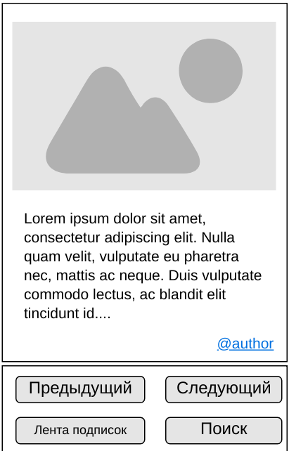

# Техническое задание [SRS по IEEE 830](http://kspt.icc.spbstu.ru/media/files/2009/course/se/IEEE-830-1998_RU.doc) проекта DevGAG

## Введение

### Назначение

Данный документ предназначен для использования в процессе оценки трудоёмкости проекта командой оценки / командой разработки.

### Конвенции документа

TODO

### Предполагаемая аудитория и предложения по чтению

Данный документ предполагается для команды оценки трудоёмкости данного проекта.

### Область назначения продукта

Данный документ описывает проект DevGAG. Сутью проекта является контент-платформа, основанная на мессенджере Telegram, с [контентом](#контент), предназначенным для людей IT индустрии.

**Главной** целью данного проекта является *получение прибыли* путём [монетизации](#функциональный-блок-модерация-контента) рекламных постов.

**Побочной** целью является предоставление возможности самовыражения людей из IT сферы.

### Ссылки

TODO

## Общее описание

### Перспектива продукта

Разрабатываемая система является новым продуктом. Схема компонентов - [в приложении](#б3-диаграмма-развёртывания)

### Функциональность продукта

Разрабатываемая система должна иметь возможность:
1. получения [контента](#контент)
2. распространения [контента](#контент)
3. модерации [контента](#контент)
4. монетизации [контента](#контент)

### Классы и характеристики пользователей

#### 1. Пользователь контента
Данный тип пользователя имеет возможность просматривать контент с помощью [бота](#бот) в [Telegram](#telegramтелеграмм). Образование и компетенции: неизвестны.

#### 2. Создатели контента
Данный тип пользователя загружает [контент](#контент) в систему. Подразумевается, что данный тип пользователя имеет некоторые стандартные представления об использовании ПК и веб-сайтов, знание стандартной терминалогии: регистрация, логин, пароль и прочие. 

#### 3. Модераторы
Данный тип пользователя является нашим сотрудником, прошедшим минимальное обучение, поэтому требований к образованию/компетенциям не подразумеваются.

#### 4. Менеджмент
Данный тип пользователя является нашим сотрудником, прошедшим минимальное обучение, однако образование в большинстве случаев не будет связано с IT, а компетенции работы с ПК могут сильно разниться.

### Среда функционирования продукта (операционная среда)

[Схема компонентов.](#б3-диаграмма-развёртывания)

Приложение будет расположено на сервере с ОС Unix. Конкретные технические характеристики пока не известны.
Различные компоненты приложения будут развёрнуты в отдельных виртуальных средах (Docker).

База данных будет расположена на отдельном сервере с СУБД (MSSQL).

Сервер приложения связан с [Telegram](#telegramтелеграмм) (Internet) и с сервером базы данных (LAN/Internet).

### Рамки, ограничения, правила и стандарты

Ограничения по техническому обеспечению: стоимость аренды удалённого сервера не должна превышать сумму, оговоренную в будущем.

Ограничения по ПО:
- ЯП для бота: python
- СУБД для хранения данных: MSSQL
- ЯП для сайта приёма контента: не определён

### Документация для пользователей

Руководства пользователей потребуется следующим категориям пользователей:
1. [Менеджмент](#3-менеджмент)
2. [Модераторы](#4-модераторы)

### Допущения и зависимости

В первую очередь наша система зависит от [Телеграмма](#telegramтелеграмм) и его API. В случае изменения API или успешной блокировки [Телеграмма](#telegramтелеграмм), потребуется срочное вмешательство программистов.

## Требования к внешним интерфейсам

### Интерфейсы пользователя 

#### Интерфейс пользователя ботом
Интерфейс разрабатывается в соответствии с API [Telegram](#telegramтелеграмм)

 

#### Интерфейс создателя контента
Требования к интерфейсу сайта приёма контента не зафиксированы, однако ожидается минималистическое решение на html и javascript.

#### Интерфейс модератора
Требования к интерфейсу модератора не зафиксированы, однако ожидается минималистическое решение на html и javascript.

#### Интерфейс менеджера
Требования к интерфейсу модератора не зафиксированы, однако ожидается минималистическое решение на html и javascript.

### Интерфейсы оборудования
Не предъявляются.

### Программные интерфейсы
Основной сервер будет исполнять компоненты при помощи Docker, взаимодействия между компонентами по REST API.

### Интерфейсы связи и коммуникации
Подключение к Telegram - через интернет.
Подключение к БД - LAN или интернет.

## Функциональность системы

### Функциональный блок "Распространение контента"

#### Описание и приоритет
Данный блок описывает основное взаимодействие с пользователем [бота](#бот).

    
Приоритет: высокий.
    
#### Причинно-следственные связи, алгоритмы (движение процессов, workflows)
1. Просмотр контента
    1. Открыть бота
    2. Нажать "Общая лента"
    3. Просмотр контента. Для перехода к следующему/предыдущему посту - соответствующие кнопки.

2. Просмотр контента конкретного создателя из ленты
    1. Исполняется первый поток(выше) или четвёрный поток(ниже).
    2. Нажать на ссылку на автора.
    3. Просмотр контента автора. Аналогично - кнопки перехода к следующему/предыдущему постам и выходу обратно к общей ленте.
 
3. Просмотр контента конкретного создателя по имени.
    1. Открыть бота
    2. Нажать "Поиск"
    3. Ввести имя
    4. Подтвердить ввод
    5. Просмотр контента автора.(аналогично выше).
    
4. Просмотр контента из ленты подписок.
    1. Открыть бота
    2. Нажать "Подписки".
    3. Просмотр контента от создателей, на которых была произведена подписка.

#### Функциональные требования

REQ-1. Общая лента контента - предоставление последовательного доступа к всему [контенту](#контент), доступному в системе.

REQ-2. Просмотр контента конкретного создателя - предоставления доступка ко всему [контенту](#контент) конкретного создателя.

REQ-3. Переход к конкретному создателю через поиск по имени 

REQ-3.1. Если пользователь с таким именем не найден: соответствующее сообщение. 

REQ-4. Переход к конкретному создателю через пост в ленте

REQ-5. Просмотр контента из ленты подписок

REQ-6. Подписка на конкретного создателя - через просмотр его контента.

### Функциональный блок "Получение контента"

#### Описание и приоритет

Данный блок описывает работу с создателями контента через сайт. 

Приоритет: средний.

#### Причинно-следственные связи, алгоритмы (движение процессов, workflows)

1. Регистрация создателя
    1. Открыть сайт
    2. Нажать "Регистрация"
    3. Ввести данные:
        1. Логин
        2. Пароль
        3. Подтверждение пароля
        4. email
        5. Подтверждение email
        6. Captcha (опционально)
     4. Нажать "Ввод"
     5. Подтвердить email (опционально)
2. Логин создателя
    1. Открыть сайт
    2. Ввести логин и пароль
    3. Нажать "Ввод"
3. Загрузка контента
    1. Успешный логин
    2. Ввод текста / загрузка изображений
    3. Нажатие ввод
#### Функциональные требования

- REQ-7. Должна быть возможность выкладывать контент с сохранением авторства
    - REQ-7.1 Должна быть возможность регистрации на сайте
        - REQ-7.1.1 Для регистрации необходимо указать данные:
            - REQ-7.1.1.1. Логин
                - REQ-7.1.1.1.1 Длина не меньше 6 не больше 30 символов
                - REQ-7.1.1.1.2 Используемые символы - из списка разрешённых символов
                - REQ-7.1.1.1.3 Логин должен быть уникальным
            - REQ-7.1.1.2. Пароль
                - REQ-7.1.1.2.1 Длина не меньше 6 не больше 30 символов
                - REQ-7.1.1.2.2 Повторный пароль и исходный должны совпадать
            - REQ-7.1.1.3. email
                - REQ-7.1.1.3.1 Адрес электронной почты должен быть корректен
                - REQ-7.1.1.3.2 Повторный email и исходный должны совпадать
        - REQ-7.1.2. Если указанные данные корретный, следует отправить сообщение на указанный email для подтверждения адреса
        - REQ-7.1.3. Если адрес был подтверждён, то аккаунт является зарегистрированным и пара логин/пароль могут быть использованы для входа на сайт
    - REQ-7.2 Должна быть возможность входа на сайт
        - REQ-7.2.1 Если нет пользователя с указанным логином, пароль неверен или email не подтверждён выдать сообщение **неверный логин/пароль**
        - REQ-7.2.2 Если данные введены верно и email подтверждён - предоставить доступ к возможности выкладывания контента

### Функциональный блок "Модерация контента"

#### Описание и приоритет

Данный блок описывает работу модераторов

Приоретет: средний

#### Причинно-следственные связи, алгоритмы (движение процессов, workflows)

1. Вход на сайт
    1. Зайти на сайт
    2. Ввести служебные логин и пароль    
2. Осуществление модерации
    1. Успешный вход
    2. Осуществление модерации: виден пост и 2 кнопки ОК и BAD
    3. Если BAD - указывается причина и требуется ли бан.
    4. В конце - показывается следующий пост. Если постов не осталось - соответствующее сообщение.

#### Функциональные требования

- REQ-8. Имеется возможность модерировать контент
    - REQ-8.1. Вход на сайт как модератор
    - REQ-8.2. Осуществление модерации при успешном входе
        - REQ-8.2.1. Просмотр текущего поста
        - REQ-8.2.2. 2 варианта OK и BAD
            - REQ-8.2.2.1 Если BAD, то нужно указать причину
            - REQ-8.2.2.2 Если BAD, то контент не попадает к пользователям
            - REQ-8.2.2.3 Если BAD, то можно забанить
        - REQ-8.2.3. Если все посты промодерированы показать соответствующее сообщение
    

### Функциональный блок "Монетизация контента"

#### Описание и приоритет

Данный блок описывает способ монетизации контента данного бота.

Приоритет: высокий

#### Причинно-следственные связи, алгоритмы (движение процессов, workflows)

1. Вход менеджера на сайт
2. Загрузка рекламного сообщения

#### Функциональные требования

TODO

## Требования на интеллектуальную собственность

## Нефункциональные требования

### Требования к производительности

### Требования к сохранности (данных)

## Критерии качества программного обеспечения

## Требования к безопасности системы

## Прочие требования

## Приложение А: Глоссарий

#### Контент 
В контексте данной системы под контентом понимается текст и/или одно или несколько изображений.

#### Бот

Боты — специальные аккаунты в Telegram, созданные для того, чтобы автоматически обрабатывать и отправлять сообщения. Пользователи могут взаимодействовать с ботами при помощи сообщений, отправляемых через обычные или групповые чаты. Логика бота контролируется при помощи HTTPS запросов к нашему API для ботов. [source](https://tlgrm.ru/docs/bots)

#### Telegram/Телеграмм

Telegram — кроссплатформенный мессенджер, позволяющий обмениваться сообщениями и медиафайлами многих форматов. [(из Wiki)](https://ru.wikipedia.org/wiki/Telegram)

https://www.web-telegram.ru

## Приложение Б: Модели процессов и предметной области и другие диаграммы
### Б.1: Диаграмма прецедентов

### Б.2: Диаграмма классов

### Б.3: Диаграмма развёртывания

## Приложение В: Список ключевых задач
