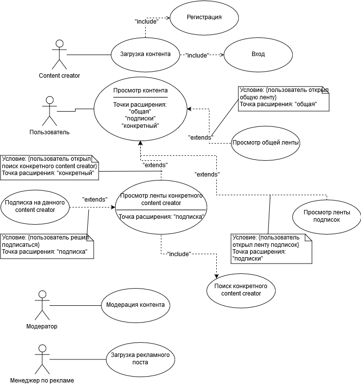
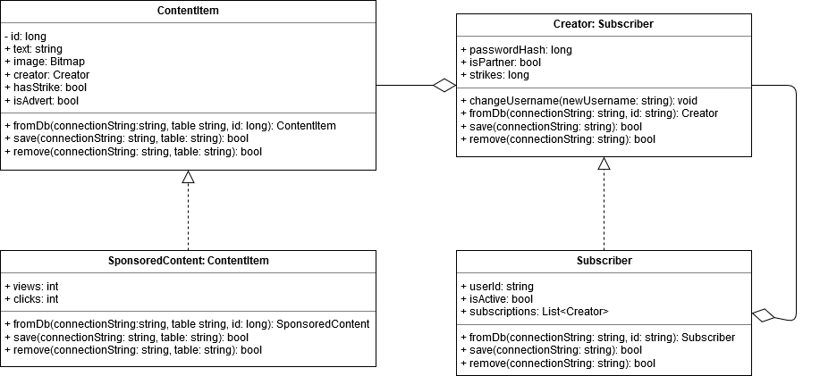
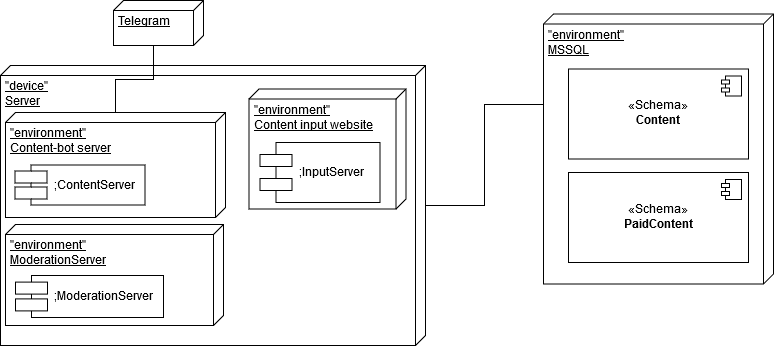

# Техническое задание [SRS по IEEE 830](https://en.wikipedia.org/wiki/Software_requirements_specification) проекта DevGAG

## Введение

### Цели

### Соглашения о терминах

### Предполагаемая аудитория и последовательность восприятия

### Масштаб проекта

### Ссылки на источники

## Общее описание

### Видение продукта

### Функциональность продукта

### Классы и характеристики пользователей

### Среда функционирования продукта (операционная среда)

### Рамки, ограничения, правила и стандарты

### Документация для пользователей

### Допущения и зависимости

## Функциональность системы

### Функциональный блок "Распространение контента"

#### Описание и приоритет

#### Причинно-следственные связи, алгоритмы (движение процессов, workflows)

#### Функциональные требования

### Функциональный блок "Получение контента"

#### Описание и приоритет

#### Причинно-следственные связи, алгоритмы (движение процессов, workflows)

#### Функциональные требования

### Функциональный блок "Модерация контента"

#### Описание и приоритет

#### Причинно-следственные связи, алгоритмы (движение процессов, workflows)

#### Функциональные требования

### Функциональный блок "Монетизация контента"

#### Описание и приоритет

#### Причинно-следственные связи, алгоритмы (движение процессов, workflows)

#### Функциональные требования

## Требования к внешним интерфейсам

## Требования на интеллектуальную собственность

### Интерфейсы пользователя (UX)

### Программные интерфейсы

### Интерфейсы оборудования

### Интерфейсы связи и коммуникации

## Нефункциональные требования

### Требования к производительности

### Требования к сохранности (данных)

## Критерии качества программного обеспечения

## Требования к безопасности системы

## Прочие требования

## Приложение А: Глоссарий

## Приложение Б: Модели процессов и предметной области и другие диаграммы
### Б.1: Диаграмма прецедентов

### Б.2: Диаграмма классов

### Б.3: Диаграмма развёртывания

## Приложение В: Список ключевых задач
